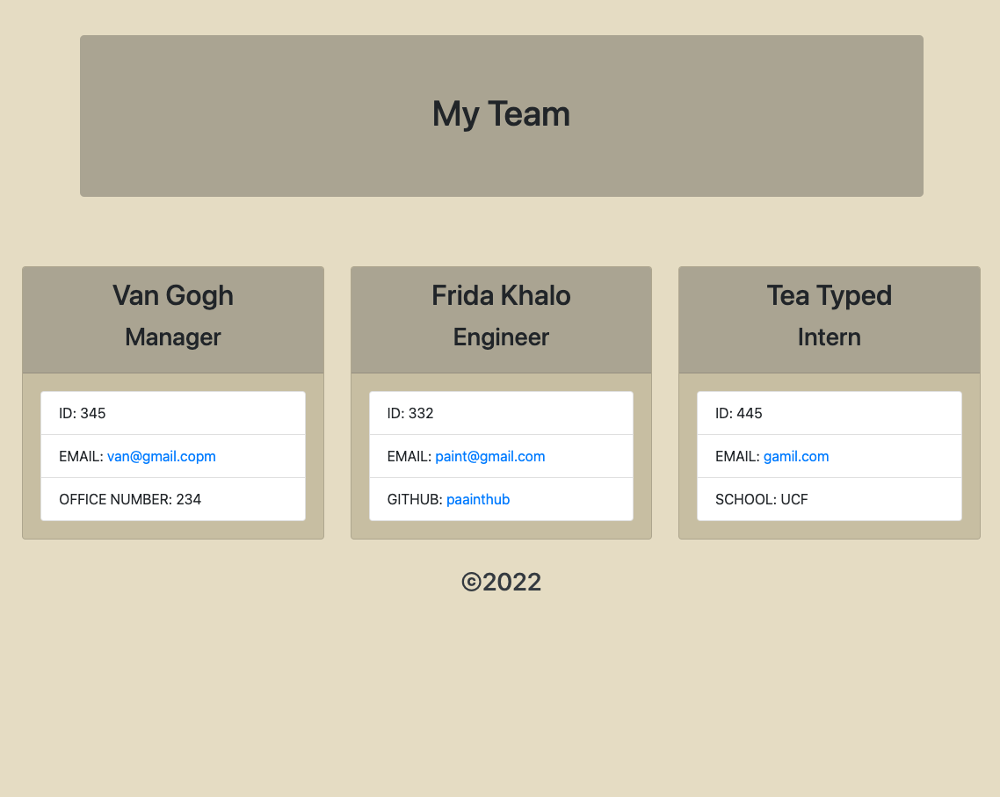

# OOP-Team-Gen-butter
## Table of Contents

## Description
Node.js command-line application that takes in information about employees on a software engineering team and generates an HTML webpage that displays summaries for each person.

## Media

https://user-images.githubusercontent.com/96491122/166076478-29d5b9d4-45f2-41dd-ad15-84164521a190.mp4

## Scope of project
- Use Node.js libraries such as: inquirer , fs, etc, to be able to collect user input about the team they want to build and generate the html and css with the team layout.

## Tools used
- NPM
- Node.js
- Java Script
- HTML
- CSS
- BootStrap

## How to install 
- run "npm install" in terminal

## How to test
- run "npm start"
- follow prompts in terminal until team is built
- html file will be generated in dist folder.
